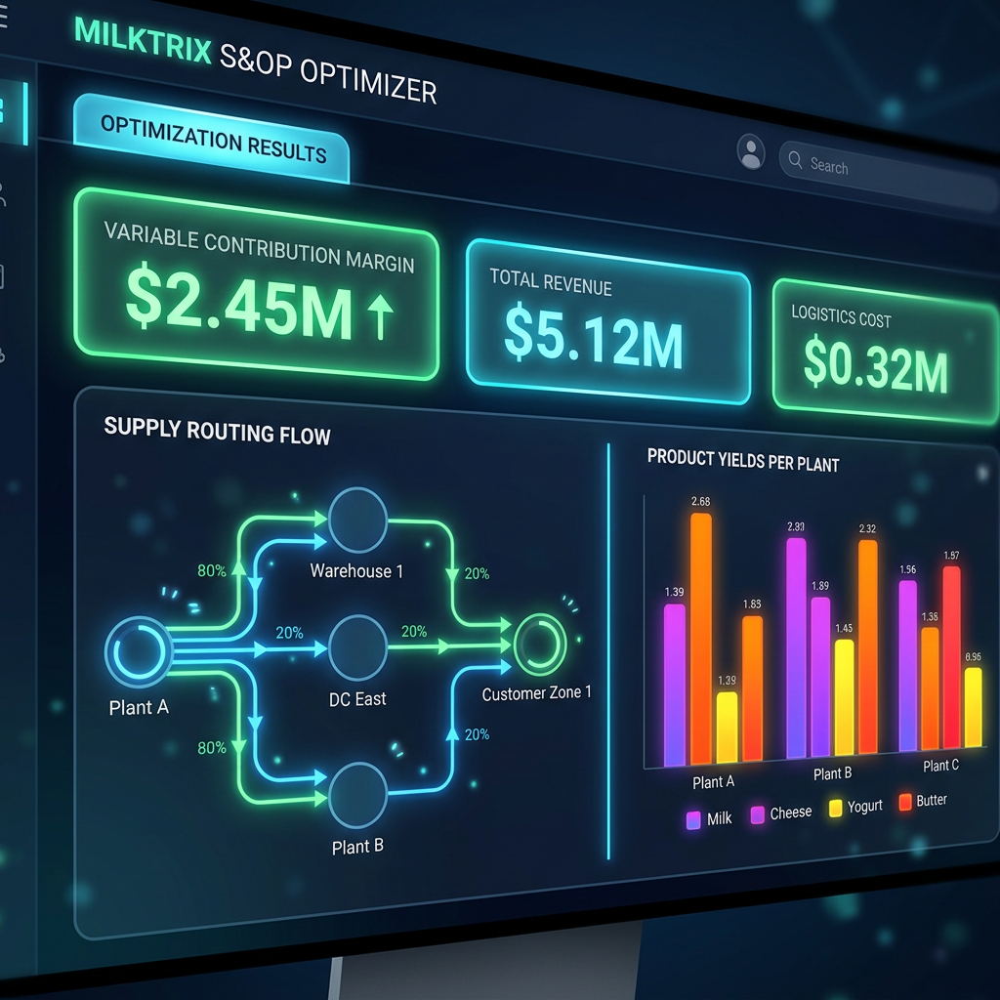
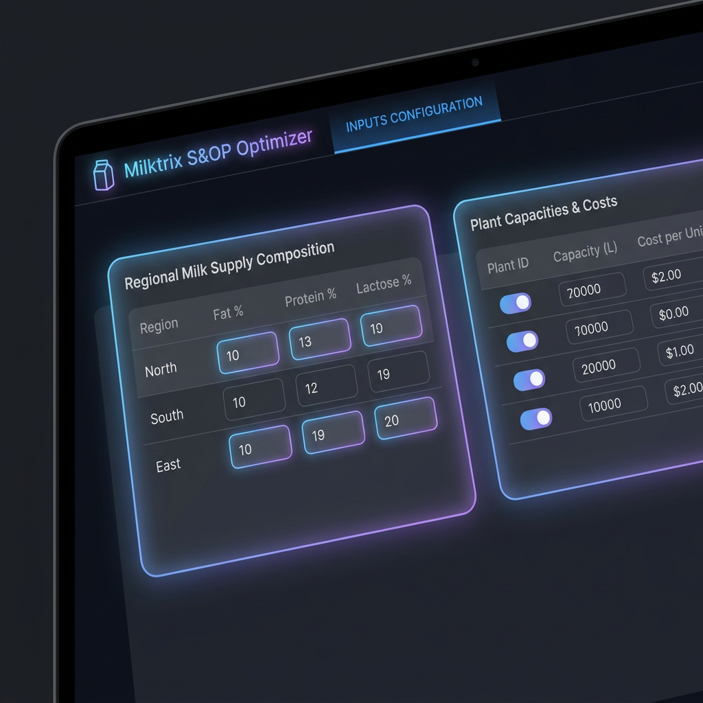
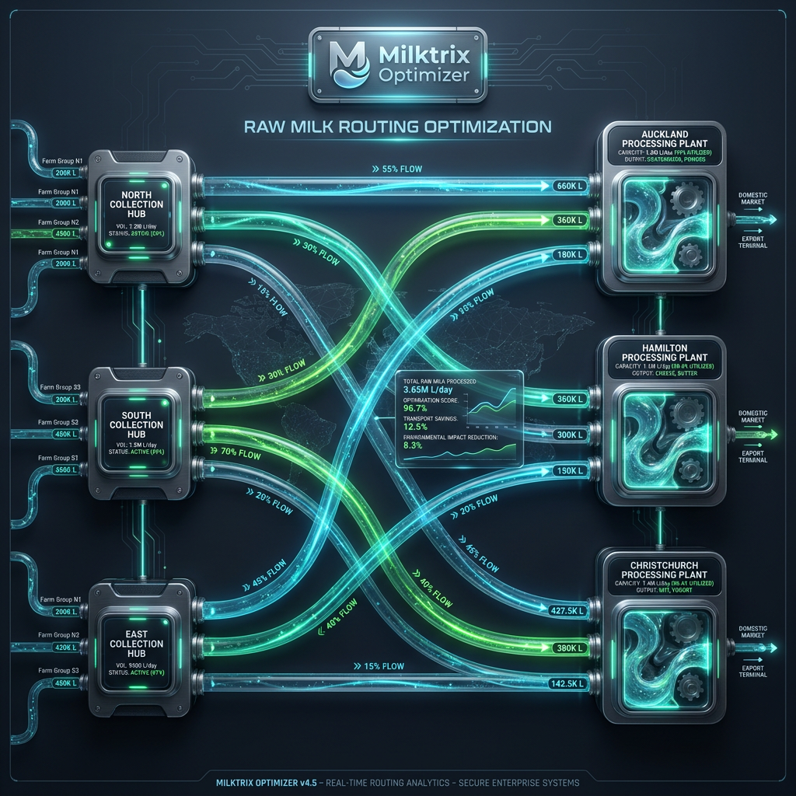
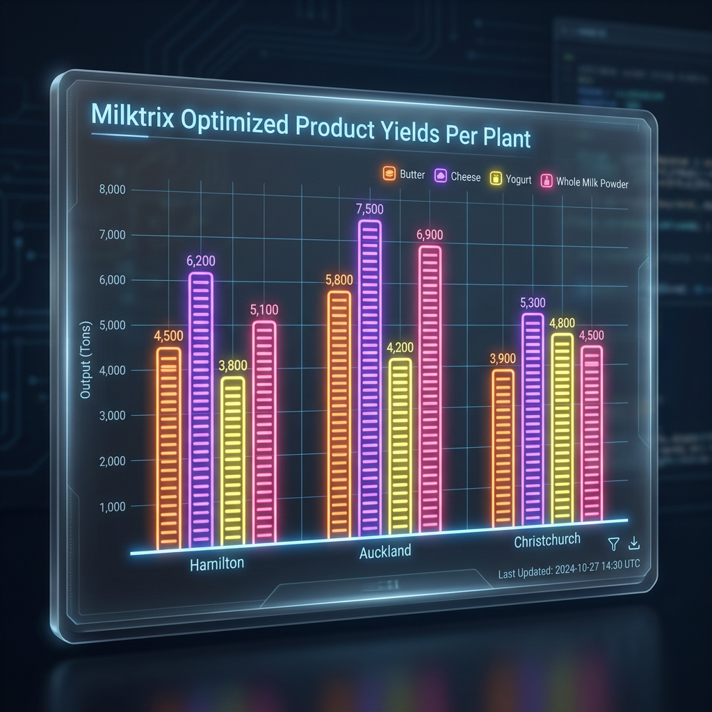

# 🥛 Milktrix S&OP Optimizer

Milktrix S&OP Optimizer is an enterprise-grade, high-fidelity Single-Page Application (SPA) designed to solve complex Sales and Operations Planning (S&OP) problems for dairy processing and logistics networks. Using a powerful Linear Programming (LP) backend powered by PuLP and the CBC solver, Milktrix maximizes the **Variable Contribution Margin (VCM)** of a dairy cooperative's supply chain.

The application features a premium, state-of-the-art dark theme dashboard with dynamic visualizations, customizable multi-tab layout configurations, and persistent SQLite database-backed run logging.

---

## 📸 Screenshots

### 📊 Tab 3: Optimization Results


### ⚙️ Tab 1: Supply & Capacities Input Configuration


### 🗺️ Raw Milk Supply Routing Flow


### 📈 Optimized Product Yields Per Plant


---

## 🌟 Core Features

1. **Multi-Tab Structured Workflow**:
   - **Tab 1 (Supply & Capacities)**: Define regional raw milk collection volumes, fat/protein/lactose solid composition percentages, and physical processing plant capacities.
   - **Tab 2 (Pricing & Demands)**: Formulate selling prices, production processing costs, product-specific yield Bills of Materials (BOM), and minimum committed contracts (hard lower bounds) vs. optional market demands (soft upper bounds).
   - **Tab 3 (Optimization Results)**: Real-time calculation of optimal raw milk routing, plant-level production output volumes, actual sales filled, and component utilization ratios, supported by vibrant interactive flowcharts and graphs.
   - **Tab 4 (Saved Run History)**: Searchable SQLite database registry containing historical runs, allowing users to reload previous optimization states back into the form fields.

2. **Advanced Linear Programming Model**:
   - **Maximize VCM**: `Revenue - Milk Procurement Cost - Processing Cost - Transport Cost`.
   - **Cooperative Supply Obligation**: Solvers are constrained to accept and fully route all regional milk supplies.
   - **Solid-Component Mass Balance**: Finished product volumes are physically limited by the actual kilograms of Fat, Protein, and Lactose solids delivered by raw milk.
   - **Committed vs. Optional Demands**: Satisfies strict contract limits before opportunistically filling spot sales for higher margins.

---

## 🛠️ Tech Stack

- **Backend**: FastAPI (Python), PuLP (LP Modeling API), CBC Solver (high-performance integer/linear programming solver).
- **Database**: SQLite (run auditing, scenario inputs, and results storage).
- **Frontend**: Modern Vanilla HTML5 / ES6 Javascript / Vanilla CSS3 (custom CSS utility system, glassmorphism, responsive CSS Grid/Flexbox layouts, glowing micro-interactions).
- **Visualizations**: Chart.js (interactive line/bar/flow representations).

---

## 🚀 Local Quick-Start

### Prerequisites
- Python 3.8 or higher
- `gclib` / `cbc` solver (if solving complex models; standard CBC binary is automatically packaged/supplied by PuLP on most major platforms)

### Running the Application

1. **Clone the Repository**:
   ```bash
   git clone <your-repo-url>
   cd milktrix-optimisation
   ```

2. **Run the Startup Script**:
   The `start.sh` script automatically creates a virtual environment, installs dependencies, and launches the FastAPI server.
   ```bash
   chmod +x start.sh
   ./start.sh
   ```

3. **Access the Dashboard**:
   Open your browser and navigate to:
   👉 **[http://localhost:8000](http://localhost:8000)**

---

## 🧮 S&OP Optimization Math Model

### 1. Decision Variables
- $x_{r, p}$: Volume of milk (Liters) transported from region $r$ to plant $p$
- $y_{p, k}$: Volume of finished product $k$ produced at plant $p$ (Tons)
- $s_{p, k}$: Volume of finished product $k$ sold from plant $p$ (Tons)

### 2. Objective Function
$$\text{Maximize} \quad \sum_{p, k} \left(s_{p, k} \cdot \text{Price}_k\right) - \sum_{r, p} \left(x_{r, p} \cdot \text{TransportCost}_{r, p}\right) - \sum_{p, k} \left(y_{p, k} \cdot \text{ProdCost}_k\right) - \sum_{r} \left(\text{SupplyVolume}_r \cdot \text{BasePrice}\right)$$

### 3. Constraints
- **Co-op Supply Processing**:
  $$\sum_{p} x_{r, p} = \text{SupplyVolume}_r \quad \forall r$$
- **Plant Max Capacity**:
  $$\sum_{r} x_{r, p} \le \text{PlantCapacity}_p \quad \forall p$$
- **Component Mass Balance (Fat, Protein, Lactose)**:
  $$\sum_{k} \left(y_{p, k} \cdot \text{BOM\_Component}_k\right) \le \sum_{r} \left(x_{r, p} \cdot \text{Component\_Pct}_{r}\right) \quad \forall p$$
- **Sales & Yield Coordination**:
  $$s_{p, k} \le y_{p, k} \quad \forall p, k$$
- **Contractual Demands (Lower & Upper Bounds)**:
  $$\text{Committed}_{p, k} \le s_{p, k} \le \text{Committed}_{p, k} + \text{Optional}_{p, k} \quad \forall p, k$$

---

## 🔒 Security & Privacy Compliance

This repository has been fully sanitized for public release:
- **No Client Identifiers**: Generic NZ-inspired dairy processing node names and collection regions are used.
- **No Secrets**: Standard SQLite databases (`*.db`), client documents (`*.pdf`), RFI briefs, and Excel requirements sheets are securely excluded via `.gitignore`.
